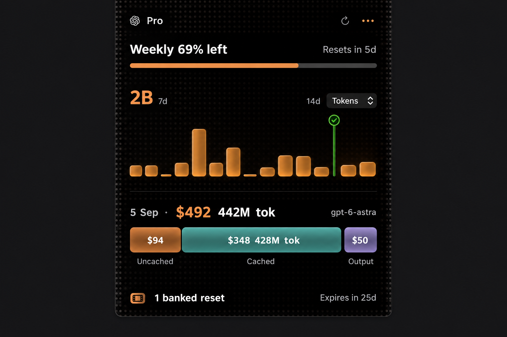

# ResetMe

A free little Mac utility for Claude and Codex usage. See what’s left around your notch. Hover for the week and your next reset; click a day to look closer.

Native AppKit + SwiftUI. macOS 14 or later. No separate ResetMe account. No subscriptions, analytics, or third-party Swift packages.



*Image recreated from the app. The [demo recording](website/assets/demo.mp4) shows the actual app.*

## Get started

This is an early source release. A signed, notarized installer is not available yet.

1. Install Xcode or the Xcode command line tools with Swift 6 or later.
2. Sign in to your subscription through Codex or Claude Code if you haven’t already.
3. Build and open ResetMe:

```sh
git clone https://github.com/kiranjd/ResetMe.git
cd ResetMe
swift test
zsh build-app.sh
open dist/ResetMe.app
```

Click the provider name at the top left to choose **Codex** or **Claude**. ResetMe remembers your choice. It reads the selected provider every minute and when your Mac wakes; the refresh button checks immediately.

Hover near the notch to open the panel. Hover the weekly row for history, click a bar for day details, and move away to close. On a Mac without a notch, use the compact indicator. The ellipsis menu offers Notch, Edge, and Floating placement. The menu-bar icon can show or hide the indicator.

## Can it work without another login?

**Yes, when a supported local sign-in is already available.** ResetMe has no login of its own, but the provider still requires authentication.

| What’s already on your Mac | What to expect |
| --- | --- |
| Signed-in Codex CLI, or a Codex desktop installation with its bundled CLI | ResetMe asks the local Codex app-server for account limits. |
| Claude Code with a valid, readable local OAuth sign-in | ResetMe reads the existing credential and requests Claude’s usage endpoint. |
| Only a browser session on ChatGPT or claude.ai | Not enough. Browser cookies aren’t imported. |
| API-key-only account | Subscription quota may be unavailable; API billing is a different measure. |
| Expired, locked, or inaccessible credentials | An explanation appears in the panel. Refresh the provider’s own sign-in, then try again. |

Keychain access is attempted without prompting. A Keychain item whose access rules exclude ResetMe remains unavailable; the app does not change those rules. It does not redeem banked resets, switch provider accounts, start a login, or refresh Claude’s stored credentials.

## How it works

- **Codex quotas:** a short-lived `codex app-server` process reads `account/rateLimits/read`. The reader prefers separate limit buckets and preserves missing data. Banked resets appear only when reported by Codex.
- **Claude quotas:** a read-only request to `https://api.anthropic.com/api/oauth/usage` uses an existing Claude Code OAuth credential. No browser session scraping.
- **History:** usage counters and model identifiers come from local session files. Codex and Claude histories stay separate. Missing days stay unknown rather than becoming zero.
- **Costs:** Codex dollar figures are partial API-equivalent estimates for recognized models, not money billed to your subscription. Unpriced models remain unpriced. Claude history currently shows token counts, not cost estimates.
- **Freshness:** failed or stale readings do not become full or empty allowance. Switching providers clears the prior provider’s visible data and ignores late responses.
- **Appearance:** the notch opens into a small black panel with amber history bars. On supported Macs, local motion-sensor input moves the decorative light and dots. The sensor runs only while the panel is expanded; an unavailable sensor leaves the app usable. Reduce Motion is respected.

Local session files can contain conversation text. ResetMe scans them to extract usage metadata; it does not display or send prompts, responses, or source code. Quota samples and preferences are stored locally in macOS preferences. History is a view of locally available sessions, not an account-wide audit.

Provider APIs, CLI protocols, and credential locations can change. Usage availability varies by account. Hardware-specific behavior on every Mac, display hot-plug, and full-screen combinations have not all been verified.

## Development

```sh
swift test
zsh scripts/check-scene.sh
zsh scripts/check-mesh.sh
zsh build-app.sh
```

Package a local build with `zsh scripts/package-release.sh`. Packaging does not sign or notarize it. Keep credentials, recordings with private desktop content, and local build output out of commits.

The small static website lives in `website/`:

```sh
python3 -m http.server 8000 --directory website
```

Open `http://localhost:8000`. There is no build step or tracking script. Three logo explorations are in `website/logos.html`; the notch-face icon is the current choice.

## Credits

Inspired by [Peter Steinberger’s CodexBar](https://github.com/steipete/CodexBar). Its provider implementations informed the integration and edge-case handling. ResetMe is an independent utility with a smaller, notch-focused interface.

OpenAI and Claude are trademarks of their respective owners; no affiliation or endorsement is implied. See [THIRD_PARTY_NOTICES.md](THIRD_PARTY_NOTICES.md) for asset provenance. Code is [MIT licensed](LICENSE).
